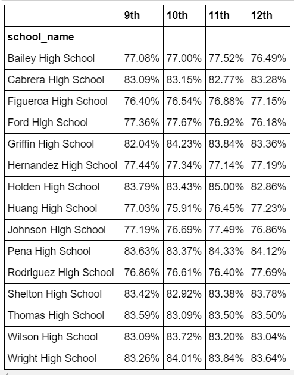

# pandas_challenge

<h2>Pandas and Python Manipulations of two CSVs of school data.</h2>

Having spent years analyzing financial records for big banks, you've finally scratched your idealistic itch and joined the education sector. In your latest role, you've become the Chief Data Scientist for your city's school district. In this capacity, you'll be helping the  school board and mayor make strategic decisions regarding future school budgets and priorities.

As a first task, you've been asked to analyze the district-wide standardized test results. You'll be given access to every student's math and reading scores, as well as various information on the schools they attend. Your responsibility is to aggregate the data to and showcase obvious trends in school performance.

A summary of this district's schools is displated below, from the jupyter notebook file:

Multiple comparisons were them made in order to elucidate any possible correllations between better student test performance and other factors like student body size, budget, and charter status.

A summary of math scores by school by grade is below:

A summary of reading scores by school by grade is below:

A comparison of student size population is displayed below. Schools were grouped into one of three categories, small/medium/large, to reduce the effect of outliers:

A direct comparison of District and Charter schools in the city were also compiled:

<h2>Discussion</h2>
Based on the rankings of Top and Bottom performing schools, the data seems to should that Charter schools tend to outperform District schools. This is most easily shown in the direct analysis between the two, where Charter schools outperform District schools in every caregory measured. However, further analysis is needed in order ot determine if other outlying factors weigh into the phenomenon (parental support, social status, etc.).

Based on all budget data, there seems to be a normal distribution in effectiveness of budget spent per student. In effect, the data reflects that student performance tapers off when too little or too much money is budgeted per student. This is best shown in the budget ranking analysis. However, further analysis is needed in order ot determine if other outlying factors weigh into the phenomenon (environmental conditions, other indv. school expenses, etc.).
